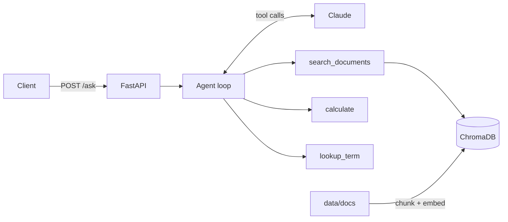

# Agentic RAG Document Q&A


A containerised question-answering API over a document collection. Instead of a fixed
"retrieve, then generate" pipeline, a Claude-powered agent decides at each step whether to
**search the documents**, **run a calculation** or **look up a term**, then answers with
citations. A retrieval-evaluation harness measures precision, recall and groundedness
against a labelled test set, and the results are used to tune chunk size and `top_k`.

**Stack:** Python 3.11 · FastAPI · ChromaDB · Anthropic Claude API · Docker · GitHub Actions · AWS EC2

---

## How it works



1. **Ingestion** – documents are split into overlapping, paragraph-aware chunks
   (`app/chunking.py`) and stored in ChromaDB with their source file.
2. **Agent loop** – the question goes to Claude with three tool definitions
   (`app/tools.py`). Claude replies with tool calls, the app executes them and sends the
   results back, and this repeats until Claude answers or the step limit is reached
   (`app/agent.py`).
3. **Answer** – the API returns the answer, the source documents used, and the list of
   tool steps taken, so every answer is traceable.

Example: *"If I drive 120 km for work, how much is reimbursed?"* makes the agent search the
expense policy, find the $0.95/km rate, call `calculate("120 * 0.95")`, and answer
"$114.00 [expense-policy.md]" rather than doing the maths itself.

Without an `ANTHROPIC_API_KEY`, the API runs in **extractive mode** and returns the most
relevant passages directly. This keeps the service usable offline and makes CI independent
of any external API.

## Quick start

```bash
git clone https://github.com/khushbukarki/agentic-rag-qa.git
cd agentic-rag-qa
cp .env.example .env            # add your ANTHROPIC_API_KEY (optional)
docker compose up --build
```

Open http://localhost:8000/docs for the interactive Swagger UI.

Without Docker:

```bash
python -m venv .venv && source .venv/bin/activate
pip install -r requirements-dev.txt
uvicorn app.main:app --reload
```

## API

| Method | Path         | Purpose                                         |
|--------|--------------|-------------------------------------------------|
| GET    | `/health`    | Status, number of indexed chunks, LLM enabled   |
| POST   | `/ask`       | Ask a question; returns answer, sources, steps  |
| GET    | `/search`    | Raw semantic search (`?q=...&k=4`)              |
| POST   | `/documents` | Upload a `.md` / `.txt` file and index it       |
| POST   | `/reindex`   | Re-index everything in `data/docs`              |

```bash
curl -X POST localhost:8000/ask -H "Content-Type: application/json" \
     -d '{"question": "Who approves an expense claim of $3,500?"}'
```

```json
{
  "answer": "Claims above $2,000 need approval from both your manager and the Finance Director [expense-policy.md].",
  "sources": ["expense-policy.md"],
  "steps": [{"tool": "search_documents", "input": {"query": "expense claim approval limit"}}],
  "mode": "agent"
}
```

## Evaluation

`eval/testset.json` holds 12 labelled questions, each with the documents that should be
retrieved and keywords a correct answer must contain (including one multi-document question).

```bash
python -m eval.run_eval                          # TF-IDF keyword baseline, no downloads
python -m eval.run_eval --store chroma           # semantic embeddings
python -m eval.run_eval --store chroma --with-answers   # also score answers
```

The harness sweeps `chunk_size` × `top_k` and reports:

- **Precision@k** – share of retrieved chunks that come from a relevant document
- **Recall@k** – share of relevant documents found in the top k
- **Groundedness** – share of answer sentences whose content words appear in the retrieved
  context (a lexical proxy that flags invented numbers or facts)
- **Answer accuracy** – share of answers containing all expected keywords

Keyword-baseline sweep on the sample documents:

| chunk_size | top_k | precision | recall | F1    |
|-----------:|------:|----------:|-------:|------:|
| 300        | 2     | 0.833     | 0.917  | 0.873 |
| 300        | 4     | 0.826     | 1.000  | 0.905 |
| **600**    | **2** | **0.875** | **1.000** | **0.933** |
| 600        | 4     | 0.708     | 1.000  | 0.829 |
| 1000       | 2     | 0.833     | 1.000  | 0.909 |
| 1000       | 4     | 0.667     | 1.000  | 0.800 |

Larger `top_k` never improved recall past 1.0 but steadily diluted precision, so the
default chunk size is 600. Very small chunks (300) lost recall on the multi-document
question because related facts were split apart.

## Testing

```bash
pytest -q
```

38 tests cover chunking edge cases, search ranking, calculator safety (rejects code
injection such as `__import__('os')`), the agent's tool-call loop using a scripted fake LLM,
the metrics, and every API endpoint. No test calls the real Claude API.

## CI/CD and deployment

`.github/workflows/ci-cd.yml` runs on every push:

1. **test** – lint with ruff, run pytest, run the retrieval evaluation
2. **build** – build the Docker image
3. **deploy** (main branch only) – SSH to EC2, pull, rebuild with Docker Compose, and
   fail the run if `/health` doesn't respond

### One-time EC2 setup

1. Launch an Ubuntu EC2 instance (t3.small or larger; Chroma's embedding model needs ~1 GB RAM).
   In the security group, allow SSH (22) from your IP and TCP 8000 (or put Nginx in front on 80/443).
2. On the instance:
   ```bash
   sudo apt update && sudo apt install -y docker.io docker-compose-v2 git
   sudo usermod -aG docker $USER && newgrp docker
   git clone https://github.com/khushbukarki/agentic-rag-qa.git
   cd agentic-rag-qa && cp .env.example .env && nano .env   # add your API key
   docker compose up -d --build
   ```
3. In GitHub → Settings → Secrets and variables → Actions, add secrets `EC2_HOST`,
   `EC2_USER` (e.g. `ubuntu`) and `EC2_SSH_KEY` (the private key contents), and a
   repository **variable** `DEPLOY_ENABLED=true`.

Every push to `main` now tests, builds and redeploys automatically.

## Design decisions

- **Tools over a fixed pipeline.** Questions needing arithmetic or definitions are handled
  by deterministic tools, so the model never has to guess at maths.
- **Safe calculator.** Expressions are parsed with Python's `ast` module and only numbers
  and arithmetic operators are allowed; `eval()` is never used.
- **Pluggable vector store.** `VectorStore` is a small protocol with a Chroma implementation
  and an in-memory TF-IDF one. Tests run fast with no model downloads, and TF-IDF doubles
  as a baseline in the evaluation.
- **LLM behind an interface.** The agent depends on a one-method `LLM` protocol, so tests
  inject a scripted fake and the provider could be swapped without touching the loop.
- **Idempotent ingestion.** Re-uploading a file replaces its old chunks instead of
  duplicating them.
- **Container hardening.** Runs as a non-root user with a health check; secrets come from
  `.env`, never the image.

## Project structure

```
app/
  main.py        FastAPI routes and app factory
  agent.py       tool-calling loop and Claude adapter
  tools.py       search, safe calculator, glossary lookup
  store.py       Chroma and in-memory vector stores
  chunking.py    paragraph-aware chunking with overlap
  ingest.py      document loading
  config.py      environment-based settings
eval/            metrics, labelled test set, parameter sweep
tests/           pytest suite
data/docs/       sample (fictional) company policies
```

## Possible next steps

- LLM-as-judge groundedness scoring alongside the lexical metric
- PDF ingestion and hybrid (keyword + semantic) retrieval
- Streaming responses and conversation memory
- Nginx + HTTPS in front of the API
